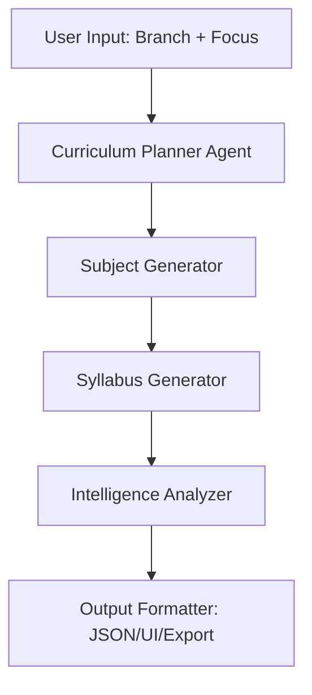

# 📊 PPT Flow — B.Tech AI Curriculum Generator

---

## Slide 1 — Title Slide
- **Title:** B.Tech Curriculum Architect
- **Subtitle:** AI-Powered Academic System Design
- **Presented by:** [Your Name]
- **Branch/Focus:** [Branch Name]

---

## Slide 2 — Problem Statement
- **Outdated University Syllabi:** Often not aligned with rapid industry changes.
- **Manual Design Bottlenecks:** Designing a full 4-year curriculum is slow and prone to inconsistencies.
- **Integration Gaps:** Lack of standardized digital formats (JSON) for LMS/ERP platforms.

---

## Slide 3 — Objective
- **Automated Generation:** Create a complete 4-year, 8-semester B.Tech curriculum instantly.
- **Industry First:** Prioritize modern tools (AI, Cloud, DevOps) over legacy systems.
- **Modular Design:** Provide structured data ready for university deployment.

---

## Slide 4 — System Architecture / Flow

---

## Slide 5 — Multi-Agent Pipeline
| Agent | Role |
|---|---|
| **Curriculum Planner** | Defines 4-year credit structure and semester goals. |
| **Subject Generator** | Selects 4-6 subjects per semester based on progression. |
| **Syllabus Generator** | Populates modules, topics, practicals, and specific tools. |
| **Intelligence Analyzer** | Maps skills, purpose, and real-world applications. |
| **Output Formatter** | Renders the final interactive UI and validates JSON. |

---

## Slide 6 — Input Parameters
- **Branch Selection:** CSE, IT, ECE, Mechanical, Civil, AIML, etc.
- **Focus Areas:** Specializations like Cybersecurity, Data Science, Robotics, or Sustainable Energy.

---

## Slide 7 — Output Structure (JSON Schema)
- **Hierarchy:** Program → Year [1-4] → Semester [1-8] → Subject List.
- **Data Points:**
  - Subject Name & Description
  - Purpose & Skills Gained
  - Real-world Applications
  - 4-6 Modules (Topics, Practicals, Tools)

---

## Slide 8 — Key Features
- **Comprehensive:** 40+ subjects across 8 semesters.
- **Modern Progression:** Fundamentals (Year 1) → Specialization (Year 3/4).
- **Practical Focus:** Every subject includes specific practicals and industry tools.
- **Zero Hallucination:** Only uses realistic, industry-standard technologies.

---

## Slide 9 — Sample Subject Card
- **Example:** *Distributed Systems & Cloud Computing*
- **Purpose:** Handling large-scale data and compute across clusters.
- **Tools:** Kubernetes, Docker, AWS, Terraform.
- **Applications:** High-availability web services like Netflix or Spotify.

---

## Slide 10 — Tech Stack & Implementation
- **Frontend UI:** HTML5, Vanilla CSS (Glassmorphism), JavaScript.
- **Data Engine:** Logic-based curriculum mapping.
- **Output:** Validated JSON for LMS/ERP compatibility.

---

## Slide 11 — Use Cases & Applications
- **Institutions:** Designing new-age engineering programs.
- **LMS Platforms:** Instant content scaffolding for instructors.
- **Industry Training:** Corporate upskilling and certification paths.

---

## Slide 12 — Future Scope
- ✨ **Generative AI Integration:** Real-time syllabus adjustment based on job market trends.
- ✨ **Regulatory Compliance:** Auto-alignment with AICTE/NBA standards.
- ✨ **PDF/Word Export:** Direct white-paper generation.

---

## Slide 13 — Conclusion
- Effectively bridges the gap between academia and industry.
- Scalable solution for modern educational needs.
- Ready for immediate deployment in academic management systems.

---

## Slide 14 — Q&A
- Thank You!
- Questions?
